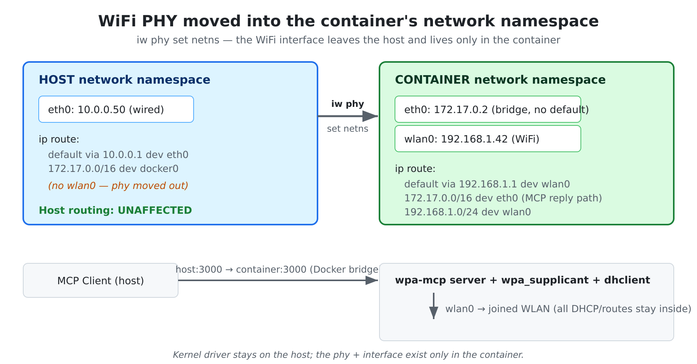
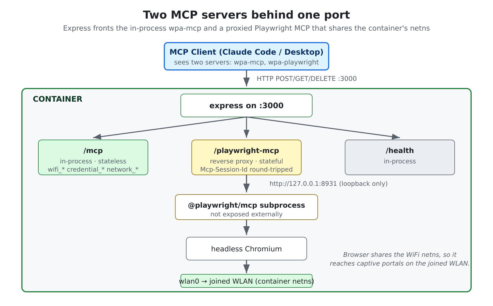
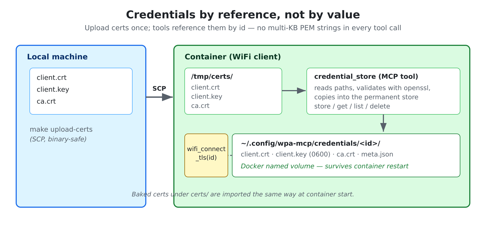

# wpa-mcp

**Control Linux WiFi from Claude and other MCP clients** — scan, connect, debug, and automate networks (WPA-PSK, WPA2-Enterprise, EAP-TLS, Hotspot 2.0, captive portals, MAC randomization) over the Model Context Protocol.

[](https://hub.docker.com/r/dogkeeper886/wpa-mcp)
[](https://hub.docker.com/r/dogkeeper886/wpa-mcp)
[](#license)
[](https://modelcontextprotocol.io)
[](#prerequisites)

wpa-mcp wraps `wpa_supplicant` and `dhclient` in 23 MCP tools, so an AI agent can drive a
real WiFi adapter — join networks, authenticate against enterprise RADIUS, work through
captive portals with a real browser, and diagnose failures from the supplicant logs. It
runs in a Docker container that holds the WiFi device in its **own network namespace**, so
none of that touches the host's routing table.

```
"Scan for networks"        → wifi_scan
"Connect to CoffeeShop"    → wifi_connect → DHCP → ip address
"Why did that fail?"       → wifi_get_debug_logs filter=eap
```

- [How it works](#how-it-works)
- [Features](#features)
- [Quick start](#quick-start)
- [Register with an MCP client](#register-with-an-mcp-client)
- [Tools](#tools)
- [Configuration](#configuration)
- [EAP-TLS certificates](#eap-tls-certificates)
- [Documentation](#documentation)

---

## How it works

Three ideas make wpa-mcp different from "shell out to `wpa_cli`". Each is worth a picture.

### 1. The WiFi device lives in the container's network namespace

The host moves the wireless **phy** into the container with `iw phy set netns`. The
interface disappears from the host; all of its routes, DHCP leases, and IP addresses exist
only inside the container. WiFi becomes the container's sole default route, while inbound
MCP traffic still arrives over the Docker bridge — the host routing table is never touched.



### 2. Two MCP servers behind one port

A single exposed port (3000) fronts two servers. `/mcp` is wpa-mcp itself, in-process and
stateless. `/playwright-mcp` is a reverse proxy to a [Microsoft Playwright
MCP](https://github.com/microsoft/playwright-mcp) subprocess whose browser shares the
container's network namespace — so it can reach captive portals on the WLAN you joined with
`wifi_connect`.



### 3. Credentials by reference, not by value

EAP-TLS certificates are uploaded once (SCP), validated, and copied into a persistent store.
Tools then reference a credential by **id** instead of passing multi-kilobyte PEM blobs in
every call — faster, and the material survives container restarts on a Docker named volume.



---

## Features

| Category | Capabilities |
|----------|-------------|
| WiFi connection | WPA-PSK, WPA2-EAP (PEAP/TTLS), EAP-TLS, Hotspot 2.0 / Passpoint, open networks, BSSID targeting |
| Network management | Scan, status, list saved, forget, reconnect |
| Privacy | Per-connection MAC randomization, pre-association MAC, real-MAC restoration after netns move |
| Diagnostics | EAP state/decision, filtered supplicant logs (eap, state, scan, error) |
| Connectivity | Ping, DNS lookup, internet check, captive-portal detection |
| Browser automation | Scripted Playwright runner + proxied Playwright MCP for step-by-step browser control inside the container's netns |
| Persistence | Credential store + saved networks on a Docker named volume, across restarts and rebuilds |

---

## Quick start

### Prerequisites

- Docker, installed and running on a Linux host
- `iw` — `sudo dnf install iw` or `sudo apt install iw`
- A PCIe or USB WiFi adapter on the host

### 1. Find the WiFi interface and its phy

```bash
ip link show | grep -E "^[0-9]+: wl"     # e.g. 3: wlp6s0
cat /sys/class/net/wlp6s0/phy80211/name  # e.g. phy0
```

### 2. Release the interface from NetworkManager

```bash
sudo make nm-unmanage WIFI_INTERFACE=wlp6s0
```

### 3. Get the image and start

Pull the published image (recommended):

```bash
docker pull dogkeeper886/wpa-mcp:2.0.0
echo "WPA_MCP_IMAGE=dogkeeper886/wpa-mcp:2.0.0" >> .env
sudo make docker-start
```

…or build it locally:

```bash
make docker-build
sudo make docker-start
```

`make docker-start` runs the container with Docker bridge networking, moves the WiFi phy
into its namespace, waits for health, and deletes the bridge default route so WiFi is the
sole default.

### 4. Verify

```bash
curl http://localhost:3000/health        # server is up
ip link show wlp6s0                       # host: gone (moved into container)
docker exec wpa-mcp ip link show wlp6s0   # container: present
```

To stop, `make docker-stop` (the phy returns to the host). To start on every boot, install
the systemd unit with `sudo make install-systemd WIFI_INTERFACE=wlp6s0`.

---

## Register with an MCP client

The container exposes two MCP endpoints on port 3000:

| Endpoint | What it is |
|---|---|
| `/mcp` | wpa-mcp — WiFi, credentials, connectivity, scripted Playwright |
| `/playwright-mcp` | Proxied Playwright MCP — step-by-step browser control inside the container's netns |

**Project-scoped** (this repo ships a [`.mcp.json`](.mcp.json) pointing at `localhost:3000`,
so Claude Code auto-discovers both servers when opened here).

**Claude Code** (from the host or any machine that can reach port 3000):

```bash
claude mcp add wpa-mcp         --transport http http://<HOST_IP>:3000/mcp
claude mcp add wpa-playwright  --transport http http://<HOST_IP>:3000/playwright-mcp
```

**Claude Desktop** — add to `claude_desktop_config.json`:

```json
{
  "mcpServers": {
    "wpa-mcp": { "url": "http://<HOST_IP>:3000/mcp" },
    "wpa-playwright": { "url": "http://<HOST_IP>:3000/playwright-mcp" }
  }
}
```

---

## Tools

23 MCP tools across five areas. Full reference: [docs/reference/01_WiFi_Tools.md](docs/reference/01_WiFi_Tools.md).

**WiFi management** — `wifi_scan`, `wifi_connect`, `wifi_connect_eap`, `wifi_connect_tls`,
`wifi_hs20_connect`, `wifi_disconnect`, `wifi_status`, `wifi_list_networks`, `wifi_forget`,
`wifi_reconnect`

**Diagnostics** — `wifi_eap_diagnostics`, `wifi_get_debug_logs`

**Browser automation** — `browser_open`, `browser_run_script`, `browser_list_scripts`

**Credentials** — `credential_store`, `credential_list`, `credential_get`, `credential_delete`

**Connectivity** — `network_ping`, `network_check_internet`, `network_check_captive`,
`network_dns_lookup`

---

## Configuration

Copy `.env.example` to `.env`. Key settings:

| Variable | Default | Description |
|----------|---------|-------------|
| `PORT` | 3000 | HTTP server port |
| `HOST` | 0.0.0.0 | Bind address |
| `WIFI_INTERFACE` | wlan0 | WiFi interface name |
| `WPA_CONFIG_PATH` | /etc/wpa_supplicant/wpa_supplicant.conf | wpa_supplicant config |
| `WPA_DEBUG_LEVEL` | 2 | Debug verbosity (1–3) |
| `WPA_MCP_BROWSER_LANG` | _(unset)_ | BCP-47 locale for the in-container browser, e.g. `pt-PT` |
| `WPA_MCP_BROWSER_TZ` | _(unset)_ | IANA timezone for the in-container browser, e.g. `Europe/Lisbon` |

The browser locale/timezone variables are read at container start and apply to
`mcp__wpa-playwright__*` and `browser_run_script`. See
[docs/design/14_Browser_Locale_Timezone_Design.md](docs/design/14_Browser_Locale_Timezone_Design.md).

---

## EAP-TLS certificates

To use EAP-TLS or Hotspot 2.0, place certificate files in `certs/` before building the
image — they are baked in and auto-imported on each container start:

```
certs/
├── <identity>_crt.pem   # client certificate (required)
├── <identity>_prv.pem   # private key (required)
└── ca*.pem              # CA certificate (optional)
```

Then `make docker-build`, `sudo make docker-start`, and connect with `wifi_connect_tls` or
`wifi_hs20_connect`. Credentials can also be added at runtime via the `credential_store`
tool. Full workflow: [docs/design/11_Credential_Store_Design.md](docs/design/11_Credential_Store_Design.md).

---

## Documentation

| Document | Description |
|----------|-------------|
| [docs/README.md](docs/README.md) | Documentation index, user flow, feature table |
| [docs/reference/00_Architecture.md](docs/reference/00_Architecture.md) | Component architecture |
| [docs/reference/05_Docker_Netns_Isolation.md](docs/reference/05_Docker_Netns_Isolation.md) | Netns architecture + route trace |
| [docs/reference/01_WiFi_Tools.md](docs/reference/01_WiFi_Tools.md) | WiFi tools + debug log filters |
| [docs/reference/03_Browser_Tools.md](docs/reference/03_Browser_Tools.md) | Scripted runner + proxied Playwright MCP |
| [docs/design/13_Dual_MCP_Playwright_Design.md](docs/design/13_Dual_MCP_Playwright_Design.md) | Dual-MCP proxy design |
| [docs/operations/20_Troubleshooting.md](docs/operations/20_Troubleshooting.md) | Docker + DNS troubleshooting |
| [CHANGELOG.md](CHANGELOG.md) | Release history |

---

## License

MIT
